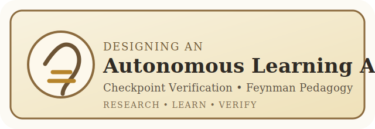

<p align="center">
  
</p>

# Infosys Springboard AIML Internship Showcase

## Designing an Autonomous Learning Agent with Checkpoint Verification and Feynman Pedagogy

This repository captures our Group 2 internship project completed during the **Infosys Springboard AIML Internship**. It combines deep research workflows, checkpoint-based understanding verification, and Feynman-style teaching loops into a practical LangGraph system that can research, explain, test, and reinforce learning. 📘

### Why this project matters

- 🧠 Bridges autonomous research with guided learning instead of stopping at report generation.
- 🧪 Uses checkpoint verification to measure whether a learner truly understands each concept.
- 🗣️ Applies Feynman pedagogy to simplify weak areas and help learners recover quickly.
- 🛠️ Demonstrates multi-agent orchestration, structured outputs, external search, and LangGraph workflows in one project.

### Internship Context

This work was completed as part of the **Infosys Springboard Internship in Artificial Intelligence and Machine Learning (AIML)**. The repository reflects a **team project outcome from Group 2**, and this README presents it as a portfolio-ready showcase while preserving the collaborative nature of the original work. 🏛️

### What This Project Does

At a high level, the project takes a user request, clarifies the scope, performs multi-step research, generates a report, breaks that knowledge into checkpoints, and then verifies learning through question-answer evaluation and simplified re-teaching where needed. It is designed to act as both a **research system** and an **autonomous learning companion**.

### Core Capabilities

- 🔎 Clarifies ambiguous user requests before beginning research.
- 🧭 Converts conversation into a structured research brief.
- 🤝 Coordinates multiple research agents through a supervisor pattern.
- 📝 Produces final synthesized reports from collected findings.
- ✅ Splits reports into learning checkpoints for mastery tracking.
- 🎓 Evaluates user answers and triggers Feynman-style remediation when needed.
- 🌐 Exposes multiple LangGraph assistants for experimentation through the API and Studio UI.

### Available LangGraph Assistants

| Assistant | Purpose |
| --- | --- |
| `scope_research` | Clarifies the request and creates a usable research brief. |
| `research_agent` | Runs iterative research with tool usage and conditional routing. |
| `research_agent_mcp` | Explores research with MCP-connected tools. |
| `research_agent_supervisor` | Delegates complex research tasks across coordinated workers. |
| `research_agent_full` | Runs the complete scope -> research -> write workflow. |
| `learning_agent` | Focuses on learning support and answer-driven instruction. |
| `deep_researcher` | Provides a research-oriented end-to-end assistant experience. |

### End-to-End Workflow

The project architecture spans both the research pipeline and the checkpoint-learning loop. The Mermaid source below is kept in the README for transparency, and a rendered SVG is linked for easier zooming on GitHub.

[Open the full workflow SVG](assets/autonomous-learning-agent-workflow.svg)

```mermaid
%%{init: {'theme': 'base', 'themeVariables': {
  'primaryColor': '#f7f1e3',
  'primaryTextColor': '#2f2a24',
  'primaryBorderColor': '#8a6d3b',
  'lineColor': '#6f5a3b',
  'secondaryColor': '#efe3c2',
  'tertiaryColor': '#fdfaf2',
  'fontFamily': 'Georgia, Times New Roman, serif'
}}}%%
flowchart LR
    A["User goal or learning request"] --> B["Clarify scope with the user"]
    B --> C["Generate a structured research brief"]
    C --> D["Supervisor coordinates research agents"]
    D --> E["Researchers gather notes and evidence"]
    E --> F["Final report generation"]
    F --> G["Checkpoint extraction from report"]
    G --> H["Create study material and quiz questions"]
    H --> I["Learner answers checkpoint quiz"]
    I --> J{"Passed checkpoint?"}
    J -->|Yes| K["Advance to next checkpoint"]
    J -->|No| L["Generate simplified Feynman explanation"]
    L --> H
    K --> M{"More checkpoints?"}
    M -->|Yes| H
    M -->|No| N["Learning session complete"]

    classDef input fill:#fdfaf2,stroke:#8a6d3b,stroke-width:1.5px,color:#2f2a24;
    classDef process fill:#efe3c2,stroke:#7a6040,stroke-width:1.5px,color:#2f2a24;
    classDef decision fill:#f7e7b6,stroke:#8a6d3b,stroke-width:1.5px,color:#2f2a24;
    classDef success fill:#dfead2,stroke:#57734c,stroke-width:1.5px,color:#24311f;

    class A input;
    class B,C,D,E,F,G,H,I,L process;
    class J,M decision;
    class K,N success;
```



### Suggested Use Cases

- 📚 Research-heavy study assistants for engineering or AIML learners.
- 🧾 Autonomous literature-review or topic-summary systems.
- 🧑‍🏫 AI tutors that need both explanation and mastery verification.
- 🏫 Internship, academic, or capstone demos for agentic AI workflows.

### Project Structure at a Glance

| Path | Purpose |
| --- | --- |
| `src/deep_research_from_scratch/` | Core LangGraph agents, prompts, state models, and learning workflows. |
| `src/deep_research_from_scratch/product/` | Product backend, auth, data models, worker, knowledge ingestion, and exports. |
| `frontend/` | Next.js workspace UI for dashboards, reports, learning sessions, invites, and analytics. |
| `alembic/` | Database migration environment for the PostgreSQL + `pgvector` product schema. |
| `docker/` | Supporting Docker assets such as PostgreSQL initialization scripts. |
| `notebooks/` | Step-by-step tutorial notebooks that build the system incrementally. |
| `langgraph.json` | LangGraph assistant registry and runtime configuration. |
| `docker-compose.yml` | Full self-hosted stack for PostgreSQL, API, LangGraph, worker, web UI, and optional Jupyter. |
| `Dockerfile` | Reusable Python service image for API, LangGraph, worker, and notebooks. |

## Full Product Platform

The repo now includes a much more complete **research + learning copilot platform** in addition to the original LangGraph internship flows.

### What the product layer now includes

- 🔐 JWT auth with workspace membership and invite acceptance.
- 🏢 Shared workspaces, projects, runs, reports, and collaboration comments.
- 🧾 Source-grounded reports with report sections and source review decisions.
- 🧠 A private project knowledge base with notes, URLs, uploaded documents, chunking, and vector-backed retrieval.
- 📈 Workspace analytics for runs, reports, learning progress, source quality, and activity.
- 🛠️ Background jobs for ingestion and exports through a dedicated worker.
- 📦 Markdown/PDF report export plus learning-session and workspace summary exports.
- 🌍 A Next.js UI scaffold for workspaces, project dashboards, reports, analytics, invites, and learning sessions.

### Primary product services

| Service | Default URL | Purpose |
| --- | --- | --- |
| Product API | `http://127.0.0.1:8001` | FastAPI backend for auth, workspaces, projects, knowledge, comments, jobs, and analytics. |
| Web UI | `http://127.0.0.1:3000` | Next.js product dashboard. |
| LangGraph | `http://127.0.0.1:8000` | Legacy/demo graph runtime and Studio access. |
| PostgreSQL | `127.0.0.1:5432` | Product persistence with `pgvector`. |
| Jupyter | `http://127.0.0.1:8888` | Optional development notebook environment. |

## Product V2 Foundation

The repository now also includes the first product-oriented foundation for a multi-user research and learning copilot:

- `copilot_v2` unified graph in `langgraph.json`
- FastAPI backend with auth, workspaces, projects, runs, reports, comments, learning sessions, and analytics
- database-backed persistence instead of file-only learning handoff
- a Next.js web app scaffold in `frontend/`
- Alembic migrations for the PostgreSQL-backed product schema
- a background worker for document ingestion and export jobs
- a private knowledge base with notes, URLs, uploaded files, and retrieval support

### Product Backend

Run the product API separately from the LangGraph dev server:

```bash
uv sync --python 3.11
uv run alembic upgrade head
uv run uvicorn deep_research_from_scratch.product.api:app --host 127.0.0.1 --port 8001 --reload
```

Useful product endpoints:

- `POST /auth/register`
- `POST /auth/login`
- `POST /auth/accept-invite`
- `GET /workspaces`
- `POST /workspaces/{workspace_id}/invites`
- `GET /workspaces/{workspace_id}/jobs`
- `POST /projects/{project_id}/runs`
- `POST /projects/{project_id}/knowledge/notes`
- `POST /projects/{project_id}/knowledge/urls`
- `POST /projects/{project_id}/knowledge/documents`
- `POST /projects/{project_id}/knowledge/search`
- `GET /reports/{report_id}`
- `POST /reports/{report_id}/status`
- `POST /reports/{report_id}/learn`
- `POST /reports/{report_id}/exports/markdown`
- `POST /reports/{report_id}/exports/pdf`
- `POST /checkpoints/{checkpoint_id}/submit`
- `GET /analytics/workspaces/{workspace_id}`

### Product Worker

Run the background worker to process ingestion and export jobs:

```bash
uv run alembic upgrade head
uv run python -m deep_research_from_scratch.product.worker
```

### Product Frontend

The web app scaffold lives in `frontend/` and is designed to sit on top of the new FastAPI service:

```bash
cd frontend
npm install
NEXT_PUBLIC_API_BASE_URL=http://127.0.0.1:8001 npm run dev
```

Optional:

- Set `NEXT_PUBLIC_DEMO_TOKEN` after registering through the backend if you want the dashboard pages to fetch live data immediately.
- For containerized use, the frontend also respects `API_BASE_URL=http://api:8001` for server-side fetching inside Docker.

### Product Frontend Routes

- `/login`
- `/workspaces`
- `/workspaces/[workspaceId]`
- `/workspaces/[workspaceId]/projects/[projectId]`
- `/reports/[reportId]`
- `/learning-sessions/[sessionId]`
- `/analytics/[workspaceId]`
- `/invites/[token]`

##  Quickstart 

### Option 1: Docker (Recommended)

The fastest way to get started is using Docker. This includes all dependencies (Python 3.11, Node.js, uv) pre-configured.

#### Prerequisites
- [Docker](https://docs.docker.com/get-docker/) installed on your system
- [Docker Compose](https://docs.docker.com/compose/install/) (usually included with Docker Desktop)

#### Quick Start

1. **Clone the repository:**
```bash
git clone https://github.com/YukiCodepth/Designing-an-Autonomous-Learning-Agent-with-Checkpoint-Verification-and-Feynman-Pedagogy.git
cd Designing-an-Autonomous-Learning-Agent-with-Checkpoint-Verification-and-Feynman-Pedagogy
```

2. **Create a `.env` file** with your API keys:
```bash
# Create .env file (or copy from .env.example)
cp .env.example .env
```

Edit `.env` and add your API keys:
```env
# Required for research agents with external search
TAVILY_API_KEY=your_tavily_api_key_here

# Required for Google Gemini models
GOOGLE_API_KEY=your_google_api_key_here

# Optional: For LangSmith tracing
LANGSMITH_TRACING=true
LANGSMITH_PROJECT=deep_research_from_scratch
```

3. **Build and run the Docker container:**
```bash
# Build the image (first time only, or after changes)
docker compose build

# Start the container
docker compose up -d
```

4. **Access the services:**

| Service | URL |
|---------|-----|
| **Product Web UI** | http://127.0.0.1:3000 |
| **Product API** | http://127.0.0.1:8001 |
| **LangGraph Studio** | https://smith.langchain.com/studio/?baseUrl=http://127.0.0.1:8000 |
| **LangGraph API Docs** | http://127.0.0.1:8000/docs |
| **Product API Docs** | http://127.0.0.1:8001/docs |
| **Jupyter (optional)** | http://127.0.0.1:8888 |

5. **View logs:**
```bash
docker compose logs -f
```

6. **Stop the container:**
```bash
docker compose down
```

Do not run the Docker and local development servers at the same time because the stack already binds ports `3000`, `5432`, `8000`, and `8001`.

#### Docker Commands Reference

```bash
# Build the image
docker compose build

# Build without cache (after Dockerfile changes)
docker compose build --no-cache

# Start in detached mode
docker compose up -d

# Start with optional notebooks
docker compose --profile dev up -d

# View logs
docker compose logs -f

# Stop containers
docker compose down

# Stop and remove volumes
docker compose down -v

# Rebuild and restart
docker compose down && docker compose build && docker compose up -d
```

---

### Option 2: Local Installation

If you prefer to run without Docker, follow these steps:

#### Product Stack (API + Worker + Web)

```bash
# from repo root
uv sync --python 3.11
uv run alembic upgrade head

# terminal 1
uv run uvicorn deep_research_from_scratch.product.api:app --host 127.0.0.1 --port 8001 --reload

# terminal 2
uv run python -m deep_research_from_scratch.product.worker

# terminal 3
cd frontend
npm install
NEXT_PUBLIC_API_BASE_URL=http://127.0.0.1:8001 npm run dev
```

Then open:

- Product UI: `http://127.0.0.1:3000`
- Product API docs: `http://127.0.0.1:8001/docs`
- LangGraph docs: `http://127.0.0.1:8000/docs`

#### Prerequisites

- **Node.js and npx** (required for MCP server in notebook 3):
```bash
# Install Node.js (includes npx)
# On macOS with Homebrew:
brew install node

# On Ubuntu/Debian:
curl -fsSL https://deb.nodesource.com/setup_lts.x | sudo -E bash -
sudo apt-get install -y nodejs

# Verify installation:
node --version
npx --version
```

- Ensure you're using Python 3.11 or later.
- This version is required for optimal compatibility with LangGraph.
```bash
python3 --version
```
- [uv](https://docs.astral.sh/uv/) package manager
```bash
curl -LsSf https://astral.sh/uv/install.sh | sh
# Update PATH to use the new uv version
export PATH="/Users/$USER/.local/bin:$PATH"
```

#### Installation

1. Clone the repository:
```bash
git clone https://github.com/YukiCodepth/Designing-an-Autonomous-Learning-Agent-with-Checkpoint-Verification-and-Feynman-Pedagogy.git
cd Designing-an-Autonomous-Learning-Agent-with-Checkpoint-Verification-and-Feynman-Pedagogy
```

2. Install the package and dependencies (this automatically creates and manages the virtual environment):
```bash
uv sync --python 3.11
```

3. Create a `.env` file in the project root with your API keys:
```bash
# Create .env file
touch .env
```

Add your API keys to the `.env` file:
```env
# Required for research agents with external search
TAVILY_API_KEY=your_tavily_api_key_here

# Required for Google Gemini models
GOOGLE_API_KEY=your_google_api_key_here

# Optional: For LangSmith tracing
LANGSMITH_TRACING=true
LANGSMITH_PROJECT=deep_research_from_scratch
```

4. Run the LangGraph server:
```bash
uv run langgraph dev --host 127.0.0.1 --port 8000 --allow-blocking
```

5. Or run notebooks using uv:
```bash
# Run Jupyter notebooks directly
uv run jupyter notebook

# Or activate the virtual environment if preferred
source .venv/bin/activate  # On Windows: .venv\Scripts\activate
jupyter notebook
```

### How to Run and Use the Project

Once the server is running, open the documentation or LangGraph Studio and choose an assistant based on your goal:

- `research_agent_full` for the complete scope -> research -> report workflow.
- `deep_researcher` for a direct research-oriented assistant flow.
- `learning_agent` when you want a tutor-style learning experience.

Useful endpoints and entry points:

- API docs: [http://127.0.0.1:8000/docs](http://127.0.0.1:8000/docs)
- LangGraph Studio: [https://smith.langchain.com/studio/?baseUrl=http://127.0.0.1:8000](https://smith.langchain.com/studio/?baseUrl=http://127.0.0.1:8000)
- Create a thread with `POST /threads`
- Search assistants with `POST /assistants/search`
- Run an assistant with `POST /threads/{thread_id}/runs/wait`

Typical usage flow:

1. Create or reuse a thread.
2. Select an assistant such as `research_agent_full`.
3. Send a human message describing the topic or learning task.
4. If the assistant asks a clarifying question, answer on the same thread.
5. Review the final report or checkpoint-learning output.

## Background  

Research is an open-ended task; the best strategy to answer a user request cannot be easily known in advance. Requests can require different research strategies and varying levels of search depth. Consider this request.

[Agents](https://langchain-ai.github.io/langgraph/tutorials/workflows/#agent) are well suited to research because they can flexibly apply different strategies, using intermediate results to guide their exploration. Open deep research uses an agent to conduct research as part of a three step process:

1. **Scope** - clarify research scope
2. **Research** - perform research
3. **Write** - produce the final report

This project extends that baseline with a **learning verification loop** that turns reports into checkpoints, evaluates user understanding, and generates simplified reinforcement when a checkpoint is not passed.

## 📝 Organization 

This repo contains 6 tutorial notebooks that build a deep research and autonomous learning system from scratch:

### 📚 Tutorial Notebooks

#### 1. User Clarification and Brief Generation (`notebooks/1_scoping.ipynb`)
**Purpose**: Clarify research scope and transform user input into structured research briefs

**Key Concepts**:
- **User Clarification**: Determines if additional context is needed from the user using structured output
- **Brief Generation**: Transforms conversations into detailed research questions
- **LangGraph Commands**: Using Command system for flow control and state updates
- **Structured Output**: Pydantic schemas for reliable decision making

**Implementation Highlights**:
- Two-step workflow: clarification -> brief generation
- Structured output models (`ClarifyWithUser`, `ResearchQuestion`) to prevent hallucination
- Conditional routing based on clarification needs
- Date-aware prompts for context-sensitive research

**What You'll Learn**: State management, structured output patterns, conditional routing

---

#### 2. Research Agent with Custom Tools (`notebooks/2_research_agent.ipynb`)
**Purpose**: Build an iterative research agent using external search tools

**Key Concepts**:
- **Agent Architecture**: LLM decision node + tool execution node pattern
- **Sequential Tool Execution**: Reliable synchronous tool execution
- **Search Integration**: Tavily search with content summarization
- **Tool Execution**: ReAct-style agent loop with tool calling

**Implementation Highlights**:
- Synchronous tool execution for reliability and simplicity
- Content summarization to compress search results
- Iterative research loop with conditional routing
- Rich prompt engineering for comprehensive research

**What You'll Learn**: Agent patterns, tool integration, search optimization, research workflow design

---

#### 3. Research Agent with MCP (`notebooks/3_research_agent_mcp.ipynb`)
**Purpose**: Integrate Model Context Protocol (MCP) servers as research tools

**Key Concepts**:
- **Model Context Protocol**: Standardized protocol for AI tool access
- **MCP Architecture**: Client-server communication via stdio/HTTP
- **LangChain MCP Adapters**: Seamless integration of MCP servers as LangChain tools
- **Local vs Remote MCP**: Understanding transport mechanisms

**Implementation Highlights**:
- `MultiServerMCPClient` for managing MCP servers
- Configuration-driven server setup (filesystem example)
- Rich formatting for tool output display
- Async tool execution required by MCP protocol (no nested event loops needed)

**What You'll Learn**: MCP integration, client-server architecture, protocol-based tool access

---

#### 4. Research Supervisor (`notebooks/4_research_supervisor.ipynb`)
**Purpose**: Multi-agent coordination for complex research tasks

**Key Concepts**:
- **Supervisor Pattern**: Coordination agent + worker agents
- **Parallel Research**: Concurrent research agents for independent topics using parallel tool calls
- **Research Delegation**: Structured tools for task assignment
- **Context Isolation**: Separate context windows for different research topics

**Implementation Highlights**:
- Two-node supervisor pattern (`supervisor` + `supervisor_tools`)
- Parallel research execution using `asyncio.gather()` for true concurrency
- Structured tools (`ConductResearch`, `ResearchComplete`) for delegation
- Enhanced prompts with parallel research instructions
- Comprehensive documentation of research aggregation patterns

**What You'll Learn**: Multi-agent patterns, parallel processing, research coordination, async orchestration

---

#### 5. Full Multi-Agent Research System (`notebooks/5_full_agent.ipynb`)
**Purpose**: Complete end-to-end research system integrating all components

**Key Concepts**:
- **Three-Phase Architecture**: Scope -> Research -> Write
- **System Integration**: Combining scoping, multi-agent research, and report generation
- **State Management**: Complex state flow across subgraphs
- **End-to-End Workflow**: From user input to final research report

**Implementation Highlights**:
- Complete workflow integration with proper state transitions
- Supervisor and researcher subgraphs with output schemas
- Final report generation with research synthesis
- Thread-based conversation management for clarification

**What You'll Learn**: System architecture, subgraph composition, end-to-end workflows

---

#### 6. Autonomous Learning Checkpoint Agent (`notebooks/6_checkpoint_agent.ipynb`)
**Purpose**: Convert generated knowledge into a guided learning loop with checkpoint verification

**Key Concepts**:
- **Checkpoint Extraction**: Breaking a report into manageable learning milestones
- **Assessment Loop**: Generating quiz questions and collecting learner answers
- **Checkpoint Evaluation**: Scoring understanding and deciding whether mastery is achieved
- **Feynman Pedagogy**: Re-explaining difficult concepts in simpler language

**Implementation Highlights**:
- Structured checkpoint schema with content, answers, scores, and feedback
- Batched checkpoint content generation for efficient study material creation
- Interrupt-driven quiz flow to pause and resume with user input
- Simplified remediation loop for checkpoints that are not passed

**What You'll Learn**: Learning-agent design, checkpoint evaluation, pedagogical feedback loops

---

### 🎯 Key Learning Outcomes

- **Structured Output**: Using Pydantic schemas for reliable AI decision making
- **Async Orchestration**: Strategic use of async patterns for parallel coordination vs synchronous simplicity
- **Agent Patterns**: ReAct loops, supervisor patterns, multi-agent coordination
- **Search Integration**: External APIs, MCP servers, content processing
- **Workflow Design**: LangGraph patterns for complex multi-step processes
- **State Management**: Complex state flows across subgraphs and nodes
- **Protocol Integration**: MCP servers and tool ecosystems
- **Learning Reinforcement**: Checkpoint-driven assessment and Feynman-style remediation

Each notebook builds on the previous concepts, culminating in a production-ready deep research system that can handle complex, multi-faceted research queries with intelligent scoping and coordinated execution.

## Contribution Guide

Contributions are welcome, especially if you want to improve the learning loop, add new research tools, refine prompts, or strengthen the documentation. 🌿

Start here:

1. Fork the repository and clone your copy.
2. Create a feature branch for your change.
3. Keep `.env` local and out of commits.
4. Test your change with either Docker or the local `uv` workflow.
5. Open a pull request with a clear summary of what changed and why.

For the full contributor workflow, branch naming suggestions, and review checklist, see [CONTRIBUTING.md](CONTRIBUTING.md).

## Future Improvements

- Add persistent learner memory across multiple study sessions.
- Expand checkpoint analytics with richer scoring, rubric support, and progress dashboards.
- Introduce source citation views inside the final learning experience.
- Add more provider choices and safer model fallback strategies.
- Support richer classroom or cohort-based evaluation scenarios.
- Improve the UI layer around checkpoint review, remediation, and progress tracking.

## Notes for Maintainers and Reviewers

- Keep the existing LangGraph assistant names stable unless you also update `langgraph.json`.
- Document notebook additions when introducing new tutorial steps.
- Preserve the research-first structure before extending the learning pipeline.
- Treat `.env`, local runtime caches, and machine-specific settings as local-only files.
